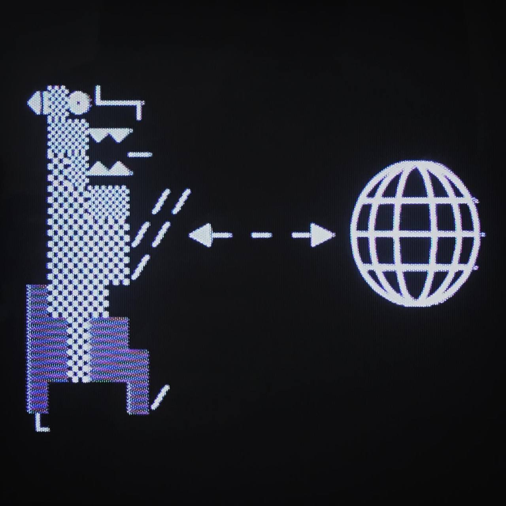
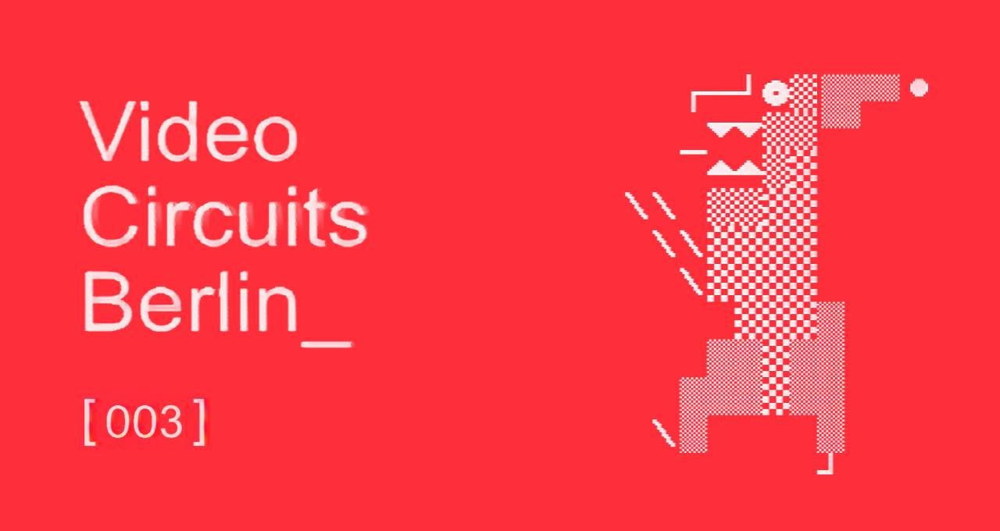

# Video Circuits Berlin

VCB is a community meet-up for anyone interested or curious about video circuitry, synthesis, visual coding, DIY electronics and tools.

# VIDICON - 12-14th Nov 2021

# VCB003 - 5th Dec 2019

# VCB002 - 17th May 2019

# VCB001 - 18th March 2019

### Get Involved

- [Video Circuits Berlin](https://www.facebook.com/groups/video-circuits-berlin)
- [Video Circuits (OG Group)](https://www.facebook.com/groups/VIDEOCIRCUITS/)
- [Lacuna Lab](https://lacunalab.org)